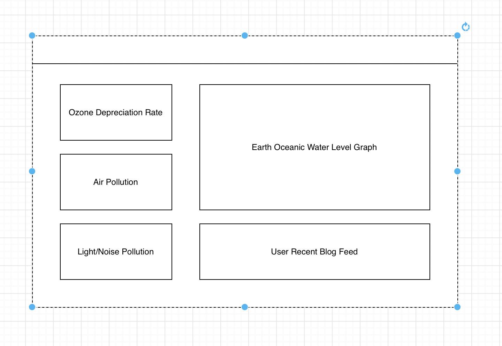

# Earth Monitor:
       
## Planning:
### Idea:
- The idea is a social media to promote a greener earth. With a dashboard linked to the global ecosystem informing the users about the health of our home planet. 
### Features:
    - [] Blog
    - [] API for ecosystem graphs
    - [] Messaging System
### ERD?:
### CHD:
***       
#### Technologies Used:
    - React
    - Typescript
    - Bootstrap
#### Resource & Credit Links:
[Email](mharmondev1503@gmail.com)      
[LinkedIn](https://www.linkedin.com/in/markharmon142)      
[Twitter](https://www.twitter.com/ManicNeo142)      